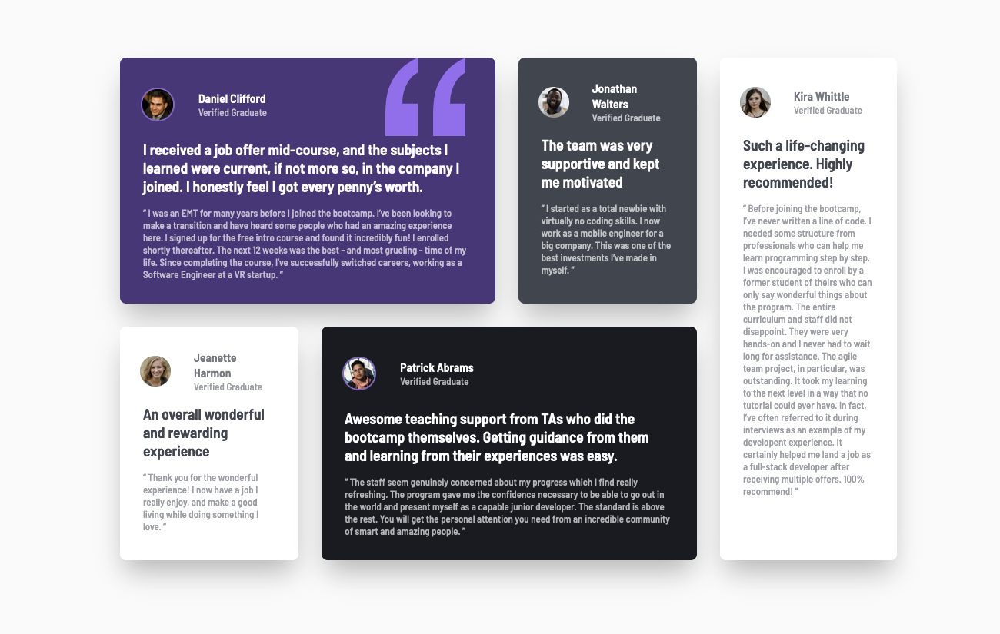

# Frontend Mentor - Testimonials grid section solution

This is a solution to the [Testimonials grid section challenge on Frontend Mentor](https://www.frontendmentor.io/challenges/testimonials-grid-section-Nnw6J7Un7). Frontend Mentor challenges help you improve your coding skills by building realistic projects.

## Table of contents

- [Overview](#overview)
  - [The challenge](#the-challenge)
  - [Screenshot](#screenshot)
  - [Links](#links)
- [My process](#my-process)
  - [Built with](#built-with)
  - [What I learned](#what-i-learned)
  - [Continued development](#continued-development)
  - [Useful resources](#useful-resources)
- [Author](#author)
- [Acknowledgments](#acknowledgments)

## Overview

### The challenge

Users should be able to:

- View the optimal layout for the site depending on their device's screen size

### Screenshot

### Links

- Solution URL: [Add solution URL here](https://your-solution-url.com)
- Live Site URL: [Add live site URL here](https://your-live-site-url.com)

## My process

### Built with

- Semantic HTML5 markup
- CSS custom properties
- Flexbox
- Mobile-first workflow

### What I learned

In this project I learned how to use flexbox to arrange elements.

### Continued development

I'd like to do a deeper dive on flexbox to get a good understanding on how all of the flex items work together. There were a couple of times it took me some experimenting to figure out how to do what I wanted to do. I think if I learn more about flexbox, I may be able to figure things out a little faster.

### Useful resources

- [Flexbox Cheatsheet](https://yoksel.github.io/flex-cheatsheet/#section-alignment) - This helped me figure out what kind of flexbox stuff I needed to use while I was styling the site.

## Author

- Website - [Andrew Harrington](https://github.com/AndrewGHarrington)
- Frontend Mentor - [@yourusername](https://www.frontendmentor.io/profile/yourusername)

## Acknowledgments

Thanks to Zach Gollwitzer for teaching me Web Development.

- [Zach's Youtube Channel](https://www.youtube.com/c/ZachGollwitzer)
